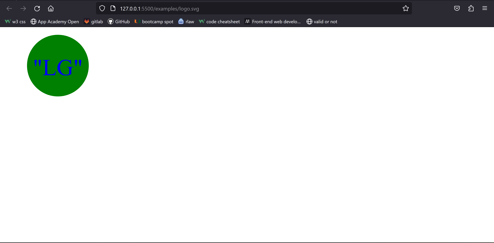

# Challenge 10 SVG Logo Generator

## Description
In this challenge I will be creating an SVG Logo Generator using node. I will demonstrate how to create the proper code to allow the user to pick styling choices for their logo using node index.js in the Terminal. 

## Installation
<ol>
    <li>Create Repository on Github</li>
    <li>Clone Repository to Computer and open in VS Code</li>
    <li>Install Node Modules</li>
    <li>Create Output folder (examples)</li>
    <li>Create individual js files for each shape/li>
    <li>Create function for each shape, and create fs directory to show end result svg file in examples folder</li>
    <li>Create functions in index.js</li>
    <li>Create README</li>
    <li>Deploy link via github and submit in bootcamp with video link</li>
</ol>

## Credits
<ol>
    <li><a href="https://static.fullstack-bootcamp.com/fullstack-ground/module-10/circle.svg">Example SVG</a></li>
    <li><a href="https://developer.mozilla.org/en-US/docs/Web/SVG/Tutorial/Basic_Shapes">Basic SVG Shapes</a></li>
    <li><a href="https://developer.mozilla.org/en-US/docs/Web/SVG/Tutorial/Texts">Text SVG</a></li>
</ol>

## Usage

Link to github: <a href="https://github.com/bizwliz/challenge10-SVGLogoMaker">Challenge 10 Github</a>

Video Demonstration: 

## License
 

## Tests
Tested using VS Code.